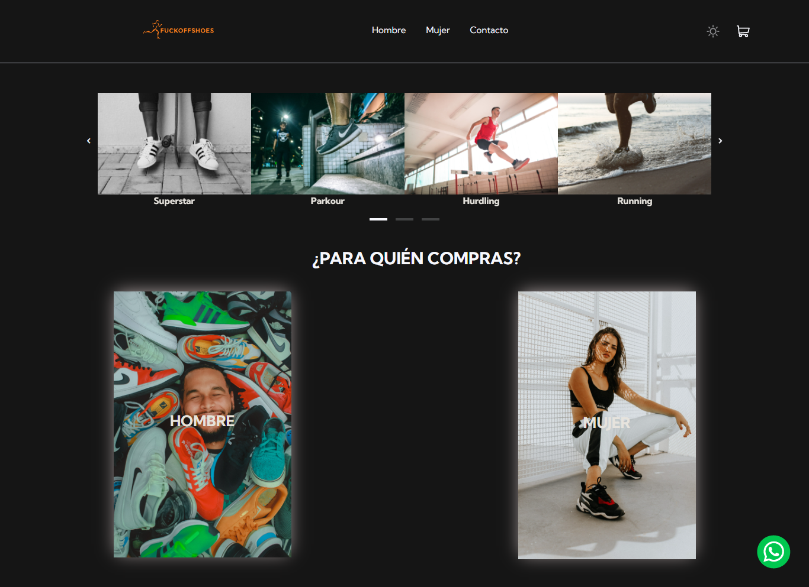

# Ecommerce | Shoes
Proyecto ecommerce de una tienda ficticia de venta de zapatillas de running, originals y muchas otras opciones más.
Este proyecto fue construido para el curso [JavaScript](https://www.coderhouse.com/online/javascript) de la Plataforma eLearning de Coderhouse.

[](https://youtu.be/xMLZfHuqOv0)

## :nut_and_bolt: Tecnologias
Para modificar este proyecto es necesario saber las tecnologias basicas de la web `html`, `css` y `javascript`. Adicional a esto, la aplicación fue construida usando las siguientes tecnologias:

* [HTML](https://lenguajehtml.com/html/) \
(HyperText Markup Language, versión 5) 
* [CSS](https://lenguajecss.com/)\
(Cascading Style Sheets, versión 3)
* [Bootstrap](https://getbootstrap.com/docs/5.1/getting-started/introduction/) v"^5.1.3"\
Bootstrap es un framework front-end utilizado para desarrollar aplicaciones web y sitios mobile first, o sea, con un layout que se adapta a la pantalla del dispositivo utilizado por el usuario.
* [JavaScript](https://www.javascript.com/)\
* [jQuery](https://react-hot-toast.com/) v3.6.0\
Libreríade  JavaScript (JS) que abre una variedad de funciones para tu sitio web.
* [SweetAlert](https://lipis.github.io/bootstrap-sweetalert/)\
Plugin de jQuery y con el cual podremos dar un aspecto profesional a los mensajes que lancemos a los usuarios.
* [Glide Js](https://glidejs.com/)\
Glide.js es un control deslizante y carrusel de JavaScript ES6 sin dependencias. Es ligero, flexible y rápido. Diseñado para deslizarse. 

## :rocket: Instalación
Para instalar este proyecto en un entorno local (su computador) abra la `terminal` de comandos y siga estos pasos:
**1. Clonar el repositorio** \
Para este paso es necesario tener instalado [Git](https://git-scm.com/).
``` shell
git clone https://github.com/AlejandroM12/FuckOffShoes-WEB.git
```
Para ingresar a la carpeta de la aplicación usamos:
``` shell
cd FuckOffShoes-WEB
```
**2. Instalamos las dependencias**\
En este punto necesitaremos tener instalado [Node](https://nodejs.org/en/) y mediante `npm` (este se instala con `Node`).
```
npm install
```
este último comando creará la carpeta `node_modules`, el cual contiene todas las librerias/dependencias que necesita la aplicación.

**3. Ejecutar la aplicación**

Ahora si ya estamos listos para ejecutar la aplicación en tu navegador.


## :wave: Contacto
* Linkedin: [morelalejandro](https://www.linkedin.com/in/morelalejandro/)
* Github: [alejandroM12](https://github.com/AlejandroM12)

## :page_facing_up: Licencia
Este proyecto esta bajo la licencia [MIT](/LICENCE).